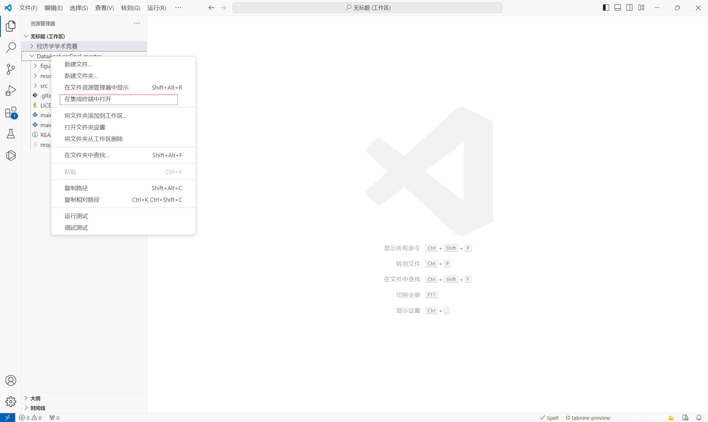
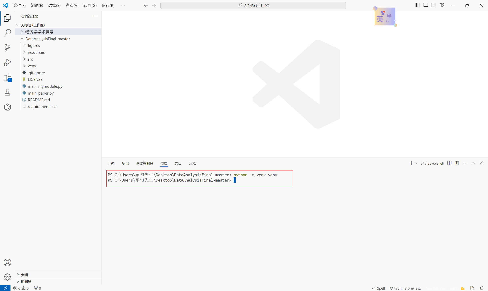
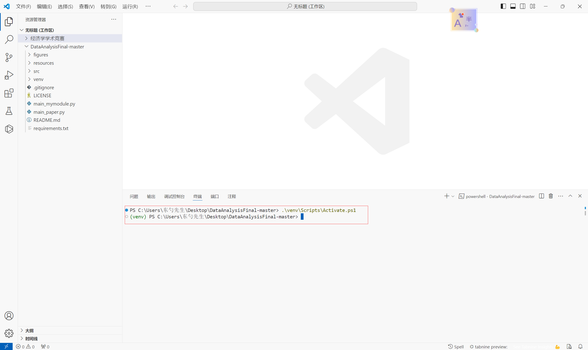
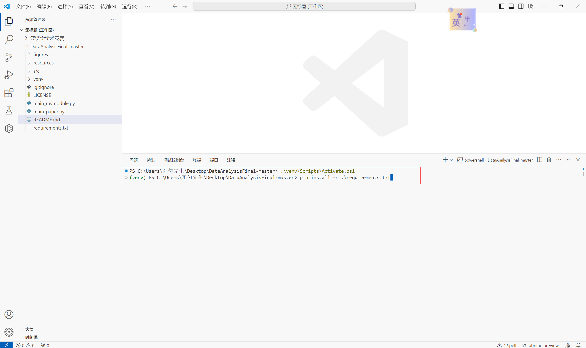
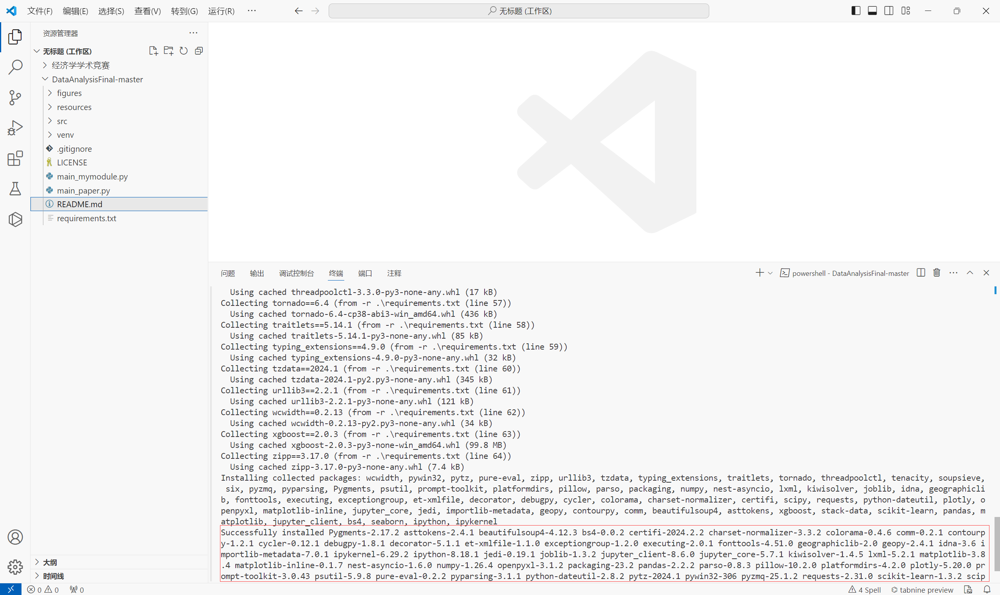

# AI_Finance_PredictionTest
2023-2024-2学期做人工智障与傻逼的预测比赛

### 一、Setup

> 非常建议使用vscode打开本项目，不过得确定你已经在vscode中配置好Python以及Jupyter notebook的环境
>
> Python版本为3.9.7

1.(如果有git的话)打开Git Bash，输入`git clone git@github.com:FantasySilence/DataAnalysisFinal.git`，获取项目源代码。

2.在vscode中打开对应文件夹，然后右键点击文件夹，选择"在集成终端中打开"。

3.在终端中输入 `python -m venv venv`创建虚拟环境。

4.创建完成后继续在终端中输入`.\venv\Scripts\Activate.ps1`激活虚拟环境，当发现终端显示的文字信息中出现"(venv)"时，激活成功。

5.激活成功后继续在终端输入` pip install -r .\requirements.txt`安装环境依赖。

6.等观察到Successfully...字样时，就可以愉快的运行啦\o/。

### 二、注意事项

#### 1. 数据的获取

数据的获取使用到了爬虫，爬取时请不要移动鼠标，具体参考main.ipynb中的注释

#### 2. 数据解析部分

数据解析部分使用了图片文字识别(pytesseract)，需要配置系统环境变量，具体可以参考这篇[博客](https://blog.csdn.net/Castlehe/article/details/118751833?ops_request_misc=&request_id=&biz_id=102&utm_term=pytesseract&utm_medium=distribute.pc_search_result.none-task-blog-2~all~sobaiduweb~default-3-118751833.142^v100^pc_search_result_base2&spm=1018.2226.3001.4187)

### 技术栈

Python | HTML

### LICENSE

GPL-3.0 license